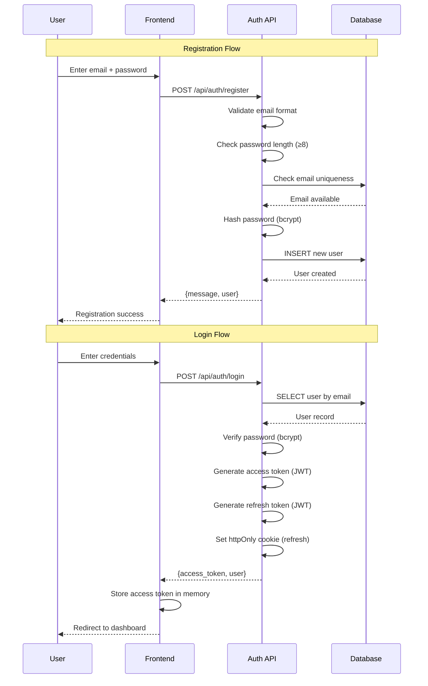
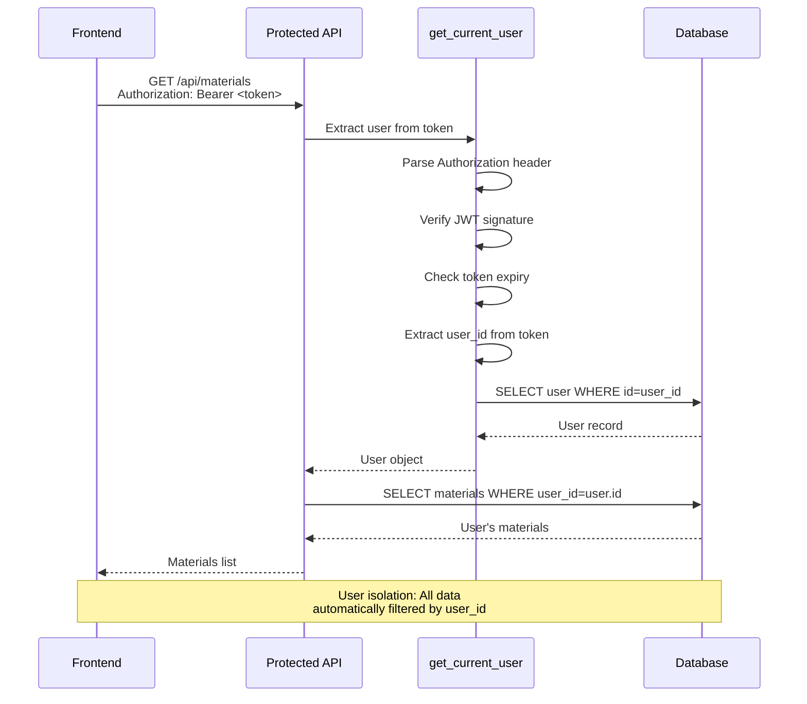
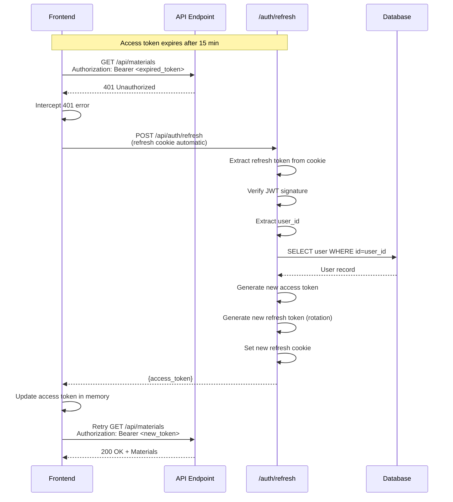
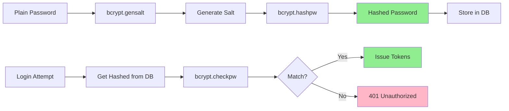
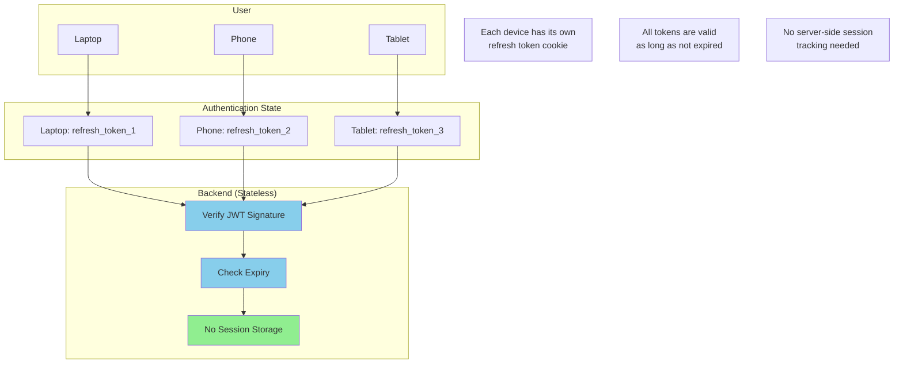
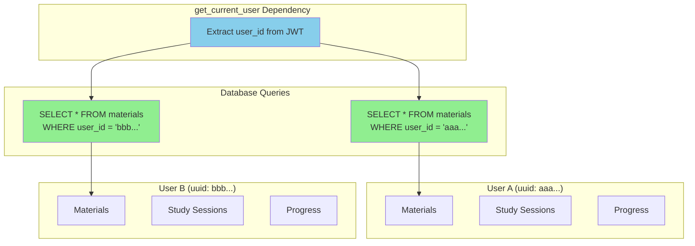
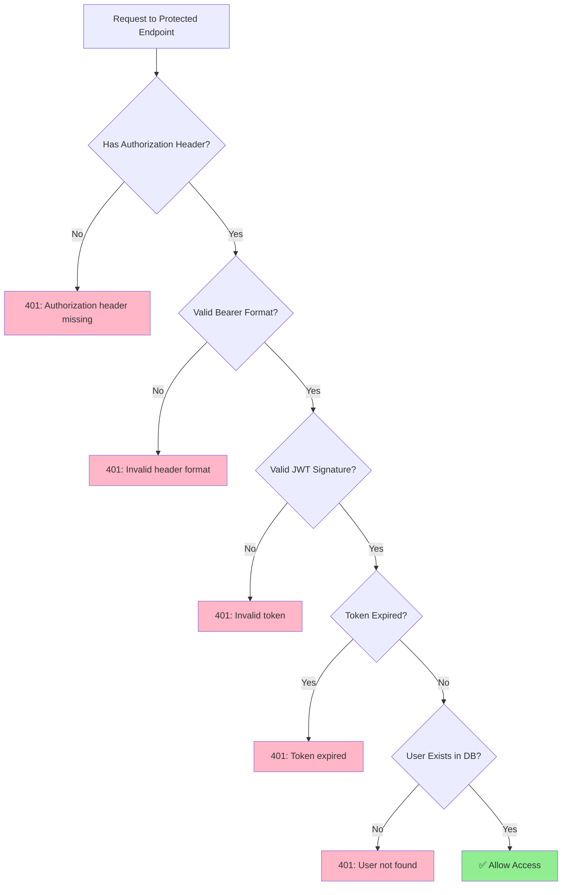
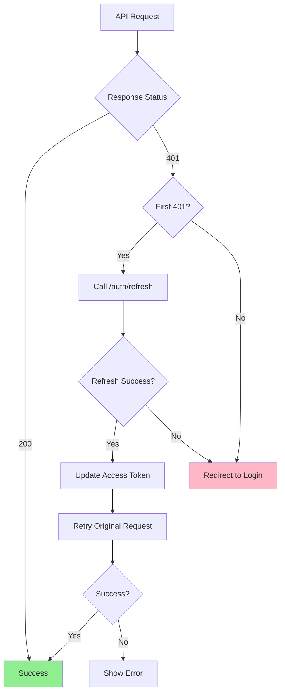
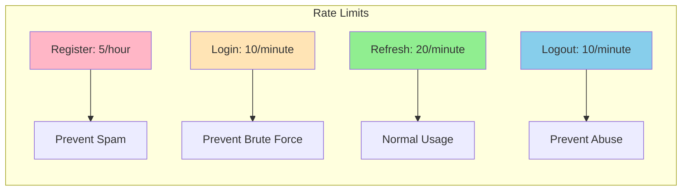

# JWT Authentication Architecture

## System Overview

```mermaid
graph TB
    subgraph "Client (Browser/Mobile)"
        A[Login Page] --> B[API Client]
        B --> C[Access Token<br/>in Memory]
        B --> D[Refresh Token<br/>httpOnly Cookie]
    end

    subgraph "Backend API"
        E[/api/auth/register] --> F[Password Hash]
        G[/api/auth/login] --> H[Verify Password]
        H --> I[Create JWT Tokens]
        I --> J[Set Cookies]

        K[/api/auth/refresh] --> L[Verify Refresh Token]
        L --> M[Issue New Access Token]

        N[Protected Endpoints] --> O[get_current_user]
        O --> P[Verify Access Token]
        P --> Q[Get User from DB]
    end

    subgraph "Database"
        R[(PostgreSQL)]
        S[users table]
        T[materials table]
        U[Other tables]
    end

    B --> E
    B --> G
    B --> K
    B --> N

    F --> R
    H --> R
    Q --> R
    R --> S
    R --> T
    R --> U

    style C fill:#90EE90
    style D fill:#FFB6C6
    style I fill:#87CEEB
    style P fill:#87CEEB
```

---

## Token Flow

### Registration & Login



### Protected Endpoint Access



### Token Refresh



---

## Security Model

### Token Structure

**Access Token**:
```json
{
  "sub": "user-uuid-here",
  "type": "access",
  "exp": 1699999999,
  "iat": 1699999000
}
```
- **Secret**: `JWT_ACCESS_SECRET`
- **Algorithm**: HS256
- **Expiry**: 15 minutes
- **Storage**: In-memory (JavaScript variable)
- **Transmission**: Authorization header (`Bearer <token>`)

**Refresh Token**:
```json
{
  "sub": "user-uuid-here",
  "type": "refresh",
  "exp": 1700604800,
  "iat": 1699999000
}
```
- **Secret**: `JWT_REFRESH_SECRET` (different!)
- **Algorithm**: HS256
- **Expiry**: 7 days
- **Storage**: httpOnly cookie
- **Transmission**: Automatic with requests to `/api/auth/refresh`

### Password Security



### Multi-Device Support



**How it works**:
1. Each device gets its own refresh token on login
2. Tokens are stored in device-specific cookies
3. Backend verifies JWT signature (no DB lookup needed)
4. All devices can be logged in simultaneously
5. Logout only affects current device (clears cookie)

---

## Data Isolation

### User Separation



**Every Endpoint Automatically Filters**:
```python
@router.get("/api/materials")
async def get_materials(
    user: User = Depends(get_current_user),  # ← JWT verification
    session: AsyncSession = Depends(get_db)
):
    # user.id is from verified JWT token
    result = await session.execute(
        select(Material).where(Material.user_id == user.id)  # ← Automatic isolation
    )
    return result.scalars().all()
```

---

## Migration Path

### Before: Hardcoded User

```python
# deps.py
HARDCODED_USER_ID = uuid.UUID("11111111-1111-1111-1111-111111111111")

async def get_current_user(session: AsyncSession) -> User:
    # Always return same user, no authentication
    return await ensure_hardcoded_user(session)
```

```python
# auth.py
@router.post("/login")
async def login():
    user = await ensure_hardcoded_user()
    # Return fake tokens (not JWT)
    return {
        "access_token": f"access-{user.id}-{timestamp}",
        "user": user
    }
```

### After: JWT Authentication

```python
# deps.py
async def get_current_user(
    authorization: str = Header(None),
    session: AsyncSession = Depends(get_db)
) -> User:
    # Extract Bearer token
    token = extract_token(authorization)

    # Verify JWT and get user_id
    user_id = verify_access_token(token)

    # Get actual user from database
    user = await get_user_by_id(session, user_id)
    return user
```

```python
# auth.py
@router.post("/login")
async def login(credentials: LoginRequest):
    # Find user by email
    user = await get_user_by_email(session, credentials.email)

    # Verify password with bcrypt
    if not verify_password(credentials.password, user.password_hash):
        raise HTTPException(401, "Invalid credentials")

    # Create real JWT tokens
    access_token = create_access_token(user.id)
    refresh_token = create_refresh_token(user.id)

    return {"access_token": access_token, "user": user}
```

---

## Request Flow Examples

### Example 1: First-Time User

```
1. User visits app → No tokens → Redirect to /login

2. User registers:
   POST /api/auth/register
   {"email": "alice@example.com", "password": "secure123"}
   → User created in DB

3. User logs in:
   POST /api/auth/login
   {"email": "alice@example.com", "password": "secure123"}
   → Returns access_token + sets refresh_token cookie

4. Frontend stores access_token in memory

5. User accesses dashboard:
   GET /api/materials
   Authorization: Bearer <access_token>
   → Backend verifies JWT → Returns alice's materials (empty)

6. User uploads material:
   POST /api/materials/upload
   Authorization: Bearer <access_token>
   → Material saved with user_id = alice's UUID
```

### Example 2: Returning User

```
1. User opens app → refresh_token cookie exists

2. Frontend checks for access_token in memory → Not found (page reload)

3. Frontend calls:
   POST /api/auth/refresh
   (refresh_token cookie sent automatically)
   → Returns new access_token

4. Frontend stores access_token in memory

5. User browses app normally with valid access_token
```

### Example 3: Multi-Device

```
Device A (Laptop):
1. Login → refresh_token_A in cookie
2. Access token stored in memory
3. Can access all APIs

Device B (Phone):
1. Login → refresh_token_B in cookie
2. Different access token in memory
3. Can access all APIs

Both devices work simultaneously!
No conflict because:
- Tokens are stateless (JWT)
- Each device has its own cookie
- Backend doesn't track sessions
```

---

## Error Handling

### Authentication Errors



### Frontend Error Recovery



---

## Rate Limiting



---

## Security Checklist

### ✅ Implemented

- **Password Security**:
  - ✅ bcrypt hashing with auto salt
  - ✅ Min password length (8 chars)
  - ✅ No plaintext storage

- **Token Security**:
  - ✅ Short-lived access tokens (15 min)
  - ✅ Long-lived refresh tokens (7 days)
  - ✅ httpOnly cookies for refresh tokens
  - ✅ Secure flag (HTTPS only)
  - ✅ SameSite=strict (CSRF protection)
  - ✅ Token rotation on refresh
  - ✅ Separate secrets for access/refresh

- **API Security**:
  - ✅ Rate limiting on all auth endpoints
  - ✅ Email validation
  - ✅ SQL injection prevention (SQLAlchemy ORM)
  - ✅ CORS configuration
  - ✅ Security event logging

- **Data Isolation**:
  - ✅ All queries filter by user_id
  - ✅ JWT-based user identification
  - ✅ Database foreign key constraints

### 🔧 Optional Enhancements

- **Future Additions**:
  - ⏳ Email verification
  - ⏳ Password reset flow
  - ⏳ 2FA/MFA
  - ⏳ OAuth providers (Google, GitHub)
  - ⏳ Token blacklist (revocation)
  - ⏳ Session management dashboard
  - ⏳ Account lockout after N failed attempts
  - ⏳ Password complexity rules
  - ⏳ Remember me (longer refresh token)

---

## Performance Characteristics

### Token Verification (O(1))

```python
# No database lookup needed for token verification!

def verify_access_token(token: str) -> UUID:
    payload = jwt.decode(token, SECRET, algorithms=["HS256"])
    # ✅ Instant verification
    # ✅ No DB query
    # ✅ Scales infinitely
    return UUID(payload["sub"])
```

### Database Queries Per Request

**Protected Endpoint**:
```
1. Verify JWT → No DB (O(1))
2. Get user by ID → 1 DB query (indexed)
3. Get user's data → 1 DB query (indexed on user_id)

Total: 2 DB queries (constant, not N+1)
```

**Token Refresh**:
```
1. Verify refresh token → No DB (O(1))
2. Get user by ID → 1 DB query (indexed)

Total: 1 DB query
```

### Scalability

```
✅ Stateless tokens → No session storage
✅ No Redis needed (for MVP)
✅ Horizontal scaling friendly
✅ CDN-friendly (no server-side state)
✅ Multi-region deployable
```

---

## Summary

**Authentication System**:
- ✅ JWT-based (stateless, scalable)
- ✅ bcrypt password hashing (secure)
- ✅ Multi-device support (separate tokens)
- ✅ Automatic token refresh (seamless UX)
- ✅ User data isolation (secure by default)
- ✅ Rate limiting (prevent abuse)
- ✅ Security logging (audit trail)

**Migration Complete**:
- ❌ Hardcoded user removed
- ✅ Real authentication implemented
- ✅ Multi-user ready
- ✅ Production-grade security

**Next Steps**:
1. Frontend login/register UI
2. Protected route guards
3. Token storage in authStore
4. Production deployment
